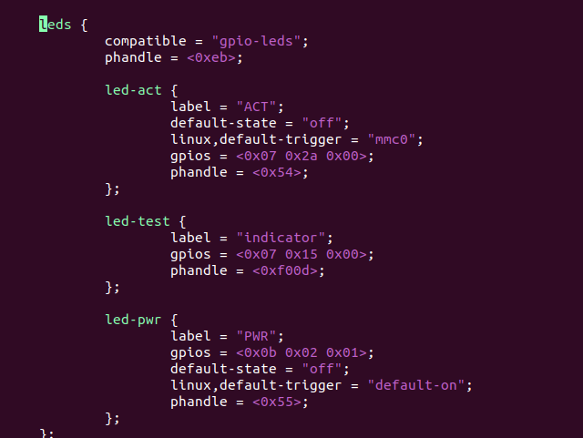
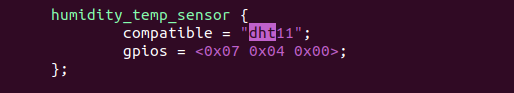
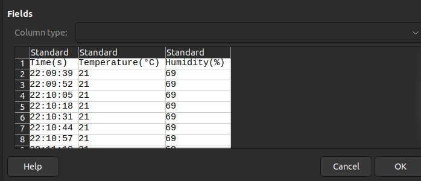
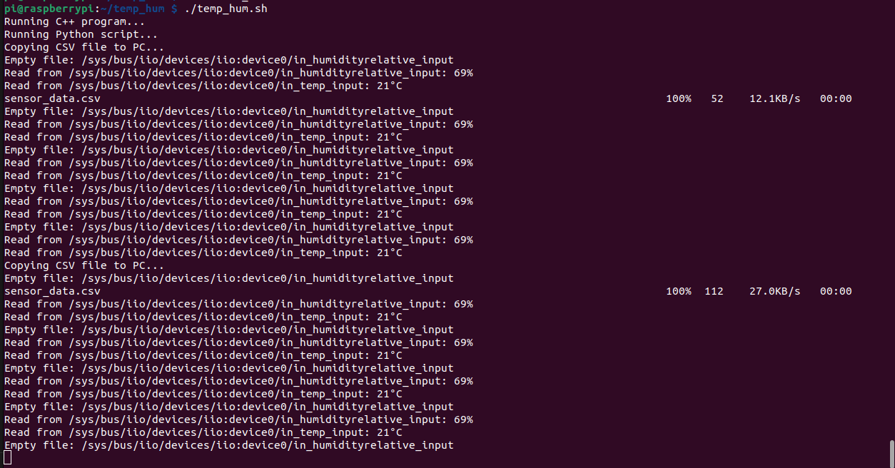
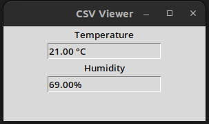

# Temperature - Humidity Project

In this project we measure temperature and humidity using DHT11 sensor on raspberry Pi.

## Project sequence

project start executing from bash script (temp_hum.sh). This bash script start to execute 2 files in background: readings and averagegui.py then copy the created csv file to PC every 1 minute.

In main.cpp we initiate an object of ReadingsReader class with desired file names and paths then we call the infinite loop ReadingsReader::run() in which we read 2 files, temperature and humidity every 10 seconds. 

Once we read the values, we update the CSV file and blink the led.


## Steps

First, we need to bring up the led and DHT11 sensor on raspberry pi.

- go to this directory in rpi repo: 
    rpi/linux/Documentation/devicetree/bindings
    and find for the hardware you need. In our project we need leds and DHT11
    ```
    git grep dht11
    git grep gpio-leds
    ```
    you will find the related yaml files, in each yaml file search for word compatible, in our project we have "gpio-leds" and "dht11".

- go to this directory in rpi repo: 
    rpi/linux/drivers and search for the files using the compatible you need
    ```
    git grep dht11
    git grep gpio-leds
    ```
    you will see the files leds-gpio.c and dht11.c

- now we make sure that our driver exist on raspberry pi or we need to compile and copy it, go to this directory rpi/linux/drivers/leds
    ```
    cat Makefile | grep leds-gpio
    ```
you will get the configuration name that needs to be active 
    ```
    obj-$(CONFIG_LEDS_GPIO)			+= leds-gpio.o
    ```
- navigate to the configuration file on raspberry pi 
    on rpi 4: /boot you will find the configuration file
    ```
    cat config-$(uname -r) | grep DHT
    CONFIG_DHT11=m
    cat config-$(uname -r) | grep CONFIG_LEDS_GPIO
    CONFIG_LEDS_GPIO=y
    ```
    from above commands we can see that leds gpio statically included in kernel while the dht11 will be activated in userspace.

- Adjust the dtb file to include the hardware needed





- Get the information of linux kernel version and architecture to cross complie the cpp codes
on Raspberry Pi
```
uname -a
```

- Finally compile the cpp codes
```
aarch64-linux-gnu-g++ -o readings -std=c++11 -pthread -static -static-libstdc++ -static-libgcc main.cpp readings.cpp csvwriter.cpp ledcontroller.cpp
```

- Use X forwarding to display the GUI on your local machine
```
ssh -X raspberry
```

- copy the files using scp command
```
scp averagegui.py raspberry:
scp readings raspberry:
scp temp_hum.sh raspberry:
```

- Run the bash file on Rpi
```
./temp_hum.sh
```

- Screenshots after running


